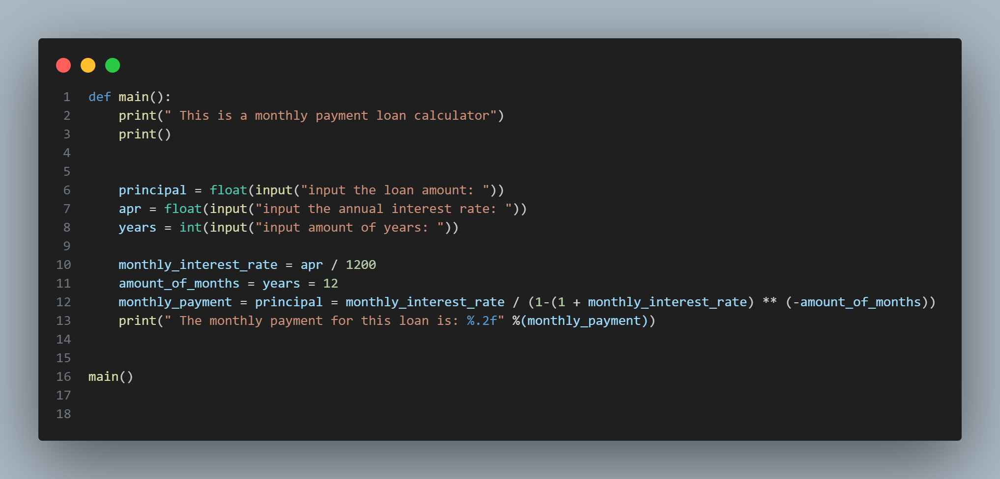

# Interest-rate-monthly-payment-calculator

To create an interest-rate-monthly-payment-calculator, tou need to follow these steps:

1. Make a def() function for a var(main), then after that print an introduction(print("This is a monthly payment calculator")).Then print a space(print()) 
2. Make a var(principal), then turn an input statement into a float(float(input("input the loan amount"))). Make another var(apr), then turn another input statement into a float(float(input("Input the amount of years")))
3. Make another var(years), but this time turn the input statement into an integer(int(input("input amount of years: "))).
4.  Now lets get into the calculation part. Make a var(monthly_interest_rate) then divide the var(apr) by 1200. Then make another var(amount_of_months), then use the var(years = 12). Make another var(monthly_payment), then put the var(principal = monthly_interest_rate / (1-(1 + monthly_interest_rate) ** (-amount_of_months)))
5. Now lets show the user the answer; print(" The monthly payment for this loan is: %.2f" %(monthly_payment)). The reason why i put '&.24' is so that if the answer comes out, only two decimal points will show. Now lets print out all our code by typing(main()) 

So thats all for the interest-rate-monthly-payment-calculator.
    If you don't understand, look at the image below

